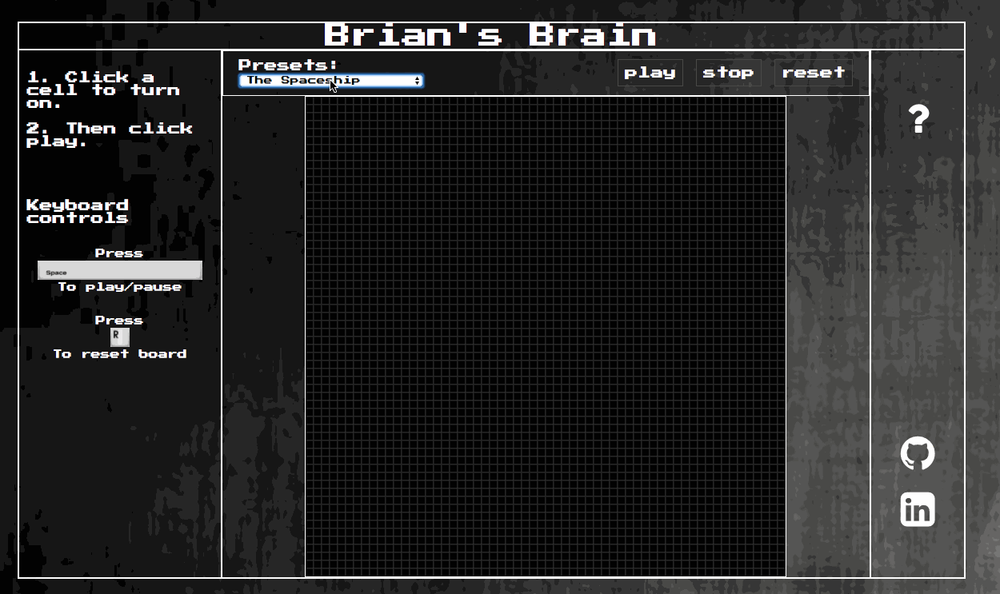
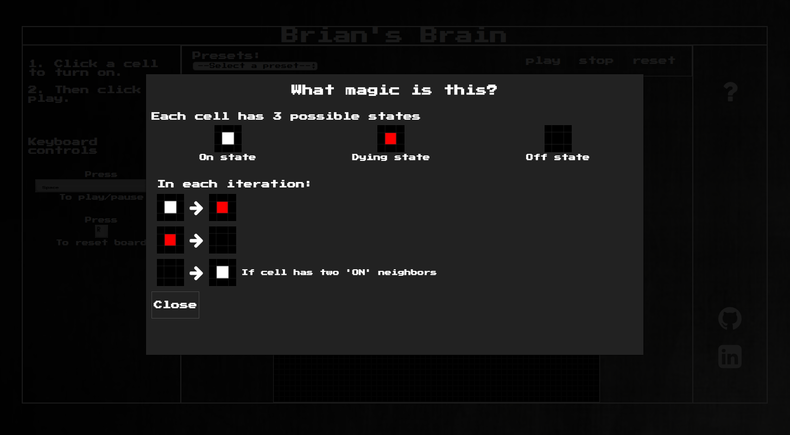

[Development Readme](docs/development_readme.md)

# Brian's Brain

[Brian's Brain Live](https://davidhu2000.github.io/brians_brain/)

## About the Game

This game is built using JavaScript, HTML5 Canvas, and `easel.js`. The game features a 60 by 60 grid that the user can click on to turn on individual cells. Once the board is set up, just k



This simulation also features an instruction modal.



## Instructions

The simulation has the following rules
- Each cell has 3 possible states: on, dying, and off.
- On state is represented by the color white, dying state by red, and off state by black.
- In each iteration, 'on' cells move to 'dying', 'dying' cells move to 'off', and 'off' cells turn 'on' if there are exactly two 'on' neighbors.

There are a few preset initial state to choose from. Or you can design your own state. To start the simulation, click 'play' or hit the space bar.

The 'reset' button, or 'r' on the keyboard will clear the entire board.

## About the Code

This simulation is written in ECMAScript 6 (ES6) format. Babel was used to translate the code to ES5.

### Class Breakdown

- `grid.js`
- `simulation_view.js`
- `simulation.js`

#### `simulation_view.js`

The SimulationView class is responsible for setting up the stage and the necessary event listeners.

```js
let stage = new createjs.Stage("simCanvas");
```

`createjs.Ticker` was used to set up the time interval.

```js
createjs.Ticker.setFPS(30);

function tick(event) {
  if(createjs.Ticker.getPaused()) {
    simulation.updateBoard();
    stage.update(event);
  }
}

createjs.Ticker.addEventListener("tick", tick);
```

The framerate is set at 30 frames per second, and a 'tick' event and function are created.

#### `grid.js`

The Grid class sets up the initial empty board.

`createjs` was used to create each individual square in the grid.

```js
square = new createjs.Shape();

square.graphics.beginStroke('#333');
square.graphics.setStrokeStyle(1);
square.snapToPixel = true;
square.graphics.beginFill('#000');

square.graphics.drawRect(0, 0, this.gridSize, this.gridSize);
square.x = this.gridSize * c;
square.y = this.gridSize * r;
square.addEventListener("click", this.handleClick);
```

#### `simulation.js`

Simulation class is responsible for the core logic of Brian's Brain. There are two objects that are stored in this class: squares, and states.

- squares holds unique ids as keys, and `createjs.Shape()` objects as values.
- states holds the same ids as keys and the current state of the square as values.

In each iteration, `updateBoard()` is run. This function will create the states for the next iteration and update the grid colors accordingly.

While updating the states, a duplicate copy of the object was created.

```js
let squaresDup = JSON.parse(JSON.stringify(this.states));
```

This is necessary because the new state is dependent on the old state, so the states object cannot be modified until all updates are completed.

## Libraries / Plugins
- `babel-core`
- `babel-loader`
- `babel-reset-es2015`
- `webpack'`
- google fonts
- font awesome
- `createjs`
- `jQuery`
