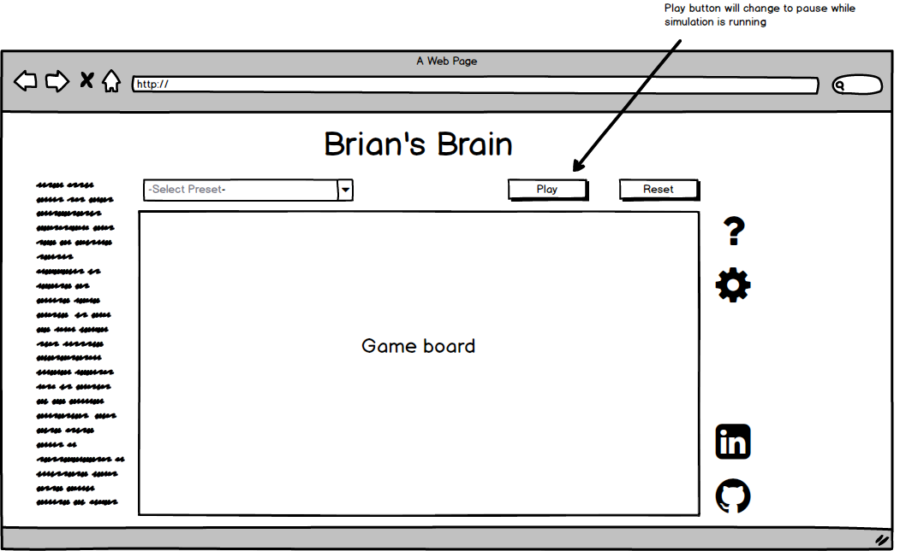
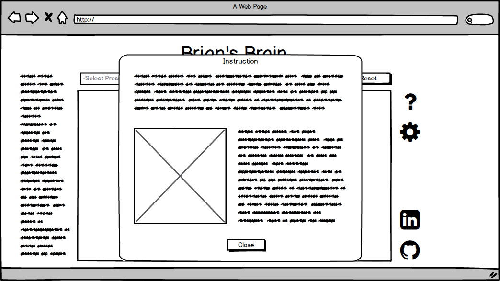

# Brian's Brain

Brian's Brain is a cellular automaton that has the following rules

- a cell can either be `on`, `off`, or `dying`.
- Each cell has 8 neighbors.
- A cell turns `on` if it was `off` and has exactly 2 neighbors that are `on`.
- All cells that were `on` turns to `dying`.
- Cells that were `dying` goes to `off`.

The dying state leads to directional movement, so many patterns in Brain's Brain is a spaceship that also emits other spaceships.

Here is an example simulation:

## Functionality and MVP

With this simulation, the user will be able to

- Create the simulation with the push of a button.
- Choose from a preset of initial states.
- Create their own initial state.
- Pause the simulation to add more `on` cells.

Also, this project will include

- A modal demonstrating the rules of the game
- A production Readme.

## Wireframes

This game will consist of a game board with basic instructions on the left hand side, and navigation links and Github and LinkedIn on the right. Inside the game board, the game initialize with a sample state. The user can click play to start the simulation.

The user can click the question button to get more detailed explanation of how the simulation works.

## Architecture and Technologies

This simulation will use the following technologies:

- Vanilla JavaScript and jQuery for the game logic.
- `EaselJS` and `Canvas` for DOM rendering.
- `webpack` to create the bundle file.

This project will include several javascript files

- `board.js` will render the gameboard.
- `simulation.js` will handle the logic of the simulation and determine the new state of the cell.
- `cell.js` will be used as an object that track a cell's current state.

## Implementation Timeline

**Day 1**

- Set up all the necessary modules and `webpack.config.js`
- Set up the barebones for the entry file and other javascript files.
- Learn how to use `easel.js` and `canvas` to render objects on the screen.

**Day 2**

- Complete `cell.js` file.
- Create basic rendering function on the game board.
- Allows state of each cell to be changed by user click.
- Create the instructions modal.

**Day 3**

- Create the simulation logic.
- Can simulation based on initial state set by board.

**Day 4**

- Allow user to customize the board color and cell color.
- Allow user to pause simulation and create new initial state.
- Create a sample list of initial states that the user can choose from.

## Bonus Features

- Allow user to create different color cells to create different simulations.
- Add different set of rules, such as the ones listed [here](http://www.msevans.com/automata/briansbrain.html)
- Allow user to create their own rules.
